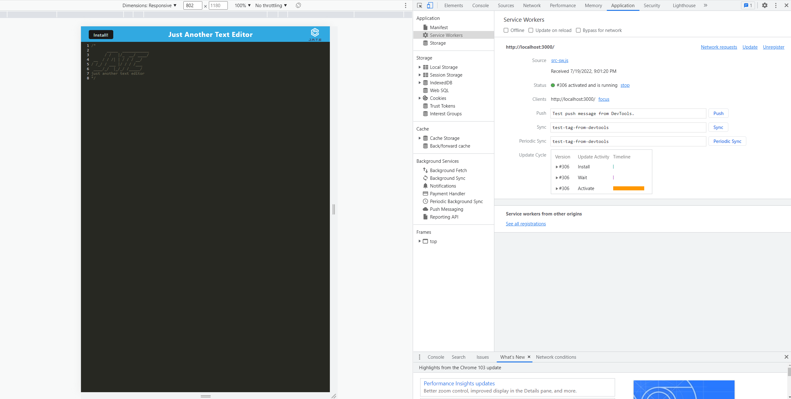

# 19 Progressive Web Applications (PWA): Text Editor

## Description

Your task is to build a text editor that runs in the browser. The app will be a single-page application that meets the PWA criteria. Additionally, it will feature a number of data persistence techniques that serve as redundancy in case one of the options is not supported by the browser. The application will also function offline.

To build this text editor, you will start with an existing application and implement methods for getting and storing data to an IndexedDB database. You will use a package called `idb`, which is a lightweight wrapper around the IndexedDB API. It features a number of methods that are useful for storing and retrieving data, and is used by companies like Google and Mozilla.

## Table of Contents:
- [Installation](#installation)
- [Usage](#usage)
- [Video](#video)
- [Mock-Up](#mock-up)
- [Link](#link)


## Installation

The applications dependencies will be installed by using the following command if run locally:

```bash
nmp i
```


## Usage

The application will start with the following command:
Development:
```bash
npm run start:dev
```

or
Production:
```bash
npm run start
```


## Mock-Up

The following animation demonstrates the application functionality:


The following image shows the application's `manifest.json` file:


The following image shows the application's registered service worker:



The following image shows the application's IndexedDB storage:


## Link
Click [here](https://immense-chamber-29422.herokuapp.com/) to visit the deployed link.
